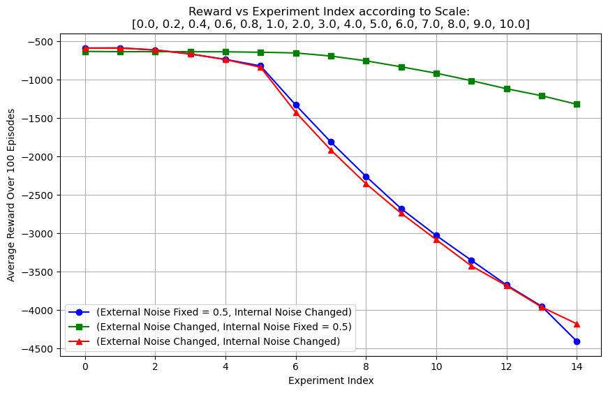

# RL_Room_Temperature_Control

## Project Overview

This project applies **Reinforcement Learning (RL)** techniques to control room temperature under fluctuating external conditions and sensor noise. We evaluated the effectiveness of traditional **Q-Learning** and **Deep Q-Network (DQN)** in maintaining a setpoint temperature despite environmental uncertainties and measurement noise.

The goal is to optimize the agents' learning process to control the room temperature effectively while being resilient to both **internal** and **external noise**. The experiment highlights the robustness, performance, and sensitivity of RL models under varying noise levels.

## Objectives

- Investigate the **effect of noise** on the performance of RL algorithms (Q-Learning and DQN).
- Identify the algorithm's **resilience to noise** and its ability to maintain stable temperature control.
- Perform **parameter sensitivity analysis** to optimize agent behavior in noisy environments.
- Compare **performance and stability** between traditional and deep RL methods.

## Methodology

The environment simulates a room's internal and external temperature dynamics. RL agents receive noisy sensor readings to adjust the internal temperature. The experiments test the agent's performance under three conditions:

1. **Fixed external noise** and varying internal noise.
2. **Fixed internal noise** and varying external noise.
3. Both internal and external noise varying simultaneously.

Noise levels are represented on a scale of `[0.0, 0.2, 0.4, 0.6, 1.0, 2.0, 3.0, 4.0, 5.0, 6.0, 7.0, 8.0, 9.0, 10.0]`.

## Results

The graph below shows the **average reward over 100 episodes** for the three experimental setups:

- **Green Line**: External noise changes, internal noise fixed. Performance is relatively stable but decreases as external noise increases.
- **Blue Line**: Internal noise changes, external noise fixed. Performance degrades quickly when internal noise exceeds 1.0.
- **Red Line**: Both internal and external noise change. Performance declines significantly, especially after a noise level of 1.0.

### Key Insights

- **DQN** consistently outperforms **Q-Learning**, showing better resilience and stability, especially in moderate noise environments.
- **Internal noise** is more detrimental to agent performance than external noise. When internal noise levels exceed 1.0, both Q-Learning and DQN see significant performance degradation.
- **Parameter tuning** improves the DQN agent's ability to learn in noisy environments, but very high noise levels (≥ 10.0) lead to poor results.

## Conclusion

This project demonstrates that **Deep Q-Learning (DQN)** is more robust than **Q-Learning** in handling noise in dynamic environments. DQN agents are better at controlling room temperature under varying external and internal conditions, achieving higher rewards overall. 

However, both methods suffer when noise levels become too high, especially when internal noise is present. Careful parameter tuning is required to maintain optimal performance under noisy conditions.
